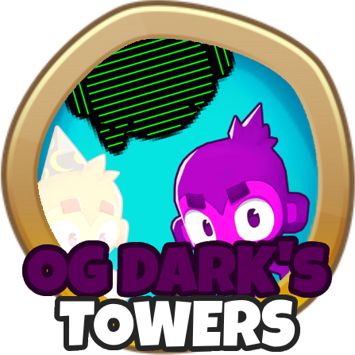

<h1 align="center">OG Darks Towers</h1>

<h1 aling="left"></h1>

## NEW VERSION [HERE](https://github.com/DarkTerraYT/DarksTowers)

Adds some custom towers to add to your stratergies. 

Join the discord to give suggestions or ways I could balance the mod.
Invite Link: https://discord.gg/xegnVEBRuE

